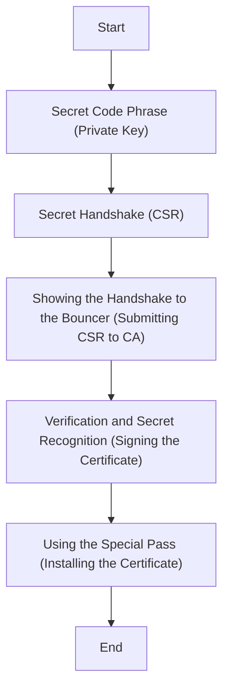

## Concepts
- Also check: https://github.com/getkub/SplunkScriplets/tree/master/thirdparty/certs

**Imagine you are a member of a secret club (your Kubernetes cluster).** To communicate securely with other members, you need a secret code phrase known only to you (your private key). You use this code phrase to scramble a message (create a CSR) that only other club members can understand (can be verified using your private key).

This scrambled message is your Certificate Signing Request (CSR). It's like a secret handshake with the club's bouncer (the Certificate Authority or CA) to prove your membership (identity).

1. **Secret Code Phrase (Private Key):** You have a special phrase known only to you (your private key) that grants you access to the club (Kubernetes cluster). This phrase is never shared with anyone.

2. **Secret Handshake (CSR):** You need to send a message to another member inside the club (communicate securely within the cluster).  However, you can't risk outsiders (unauthorized access) intercepting the message. So, you use your secret code phrase (private key) to scramble the message (encrypt it). This scrambled message becomes your Certificate Signing Request (CSR). It's a complex jumble of words that only someone who knows the secret code (your private key) can understand.

3. **Showing the Handshake to the Bouncer (Submitting CSR to CA):**  You present the scrambled message (CSR) to the club's bouncer (the Certificate Authority or CA). This bouncer has a master list of all valid code phrases (trusted root certificate) for club members (authorized users within the cluster).

4. **Verification and Secret Recognition (Signing the Certificate):** The bouncer (CA) uses the master list (trusted root certificate) to try to decipher a part of your scrambled message (verifies the CSR using its own private key). If it matches your secret code phrase (private key), it proves you're a legitimate member (authenticated user). The bouncer then creates a special pass (signed certificate) with a unique stamp (digital signature) that confirms your identity and grants you access.

5. **Using the Special Pass (Installing the Certificate):**  You receive the special pass (signed certificate) with the stamp (digital signature) from the bouncer (CA). This signed certificate is what you present to other members (services within the cluster) to prove your identity. You wouldn't share your secret code phrase (private key) with anyone, but the signed document (certificate) is safe to share as it doesn't reveal your secret.  This certificate allows you to securely communicate with other authorized members within the club (secure communication within the Kubernetes cluster).

